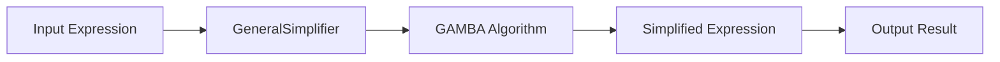
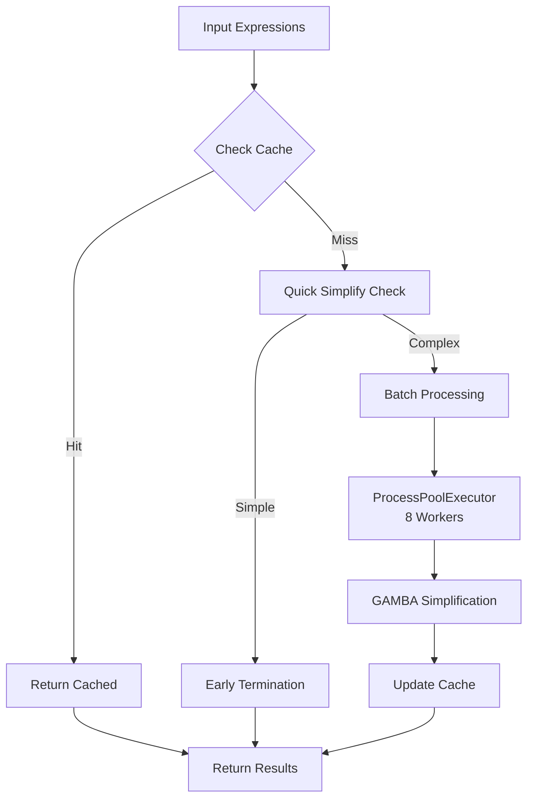
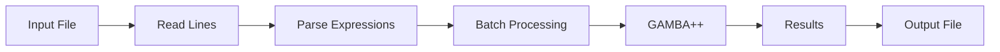
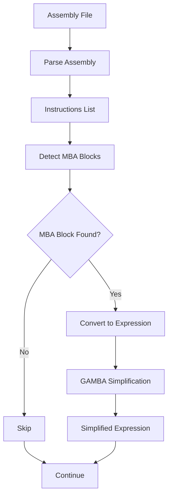
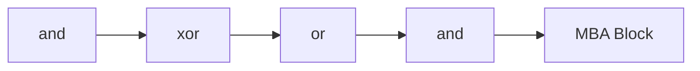
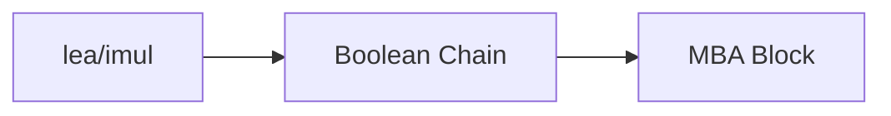
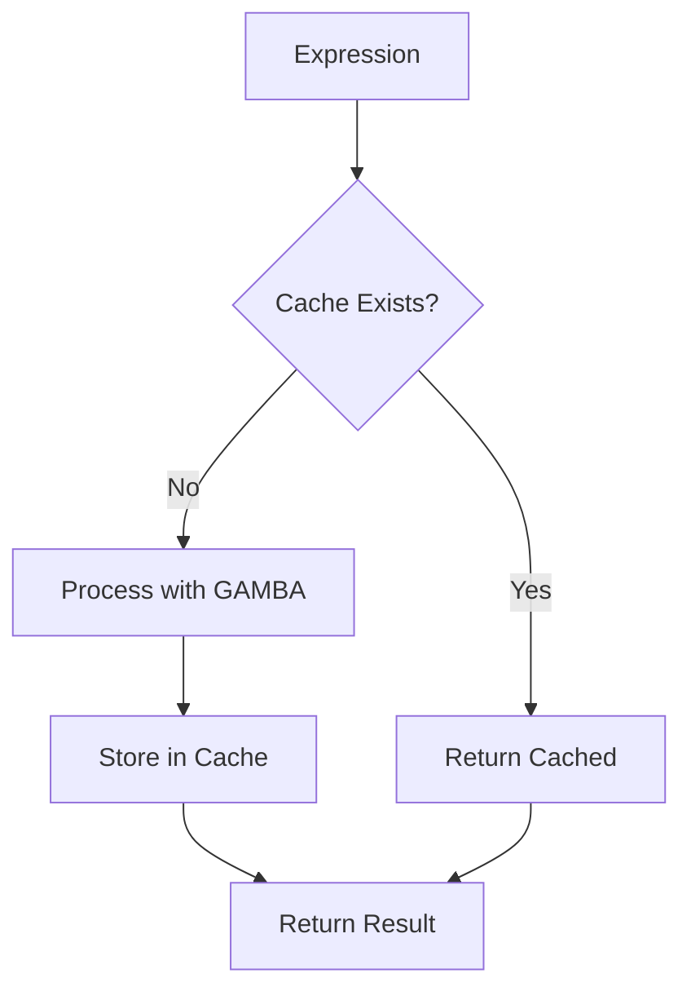
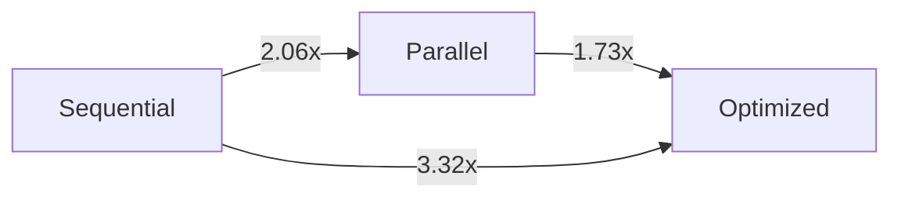
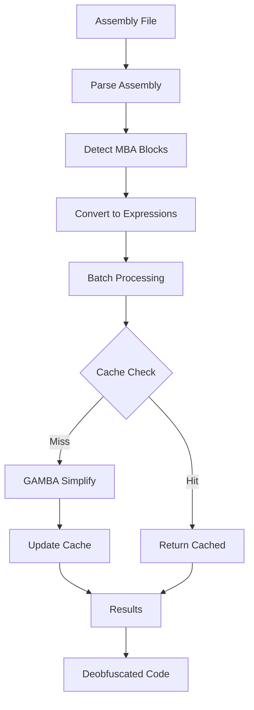

# How to Use This Framework

This comprehensive guide provides detailed examples and diagrams for using GAMBA++ in various scenarios.

## Table of Contents

1. [Direct Expression Input](#1-direct-expression-input)
2. [File-Based Input](#2-file-based-input)
3. [Assembly Interpretation](#3-assembly-interpretation)
4. [Advanced Usage Patterns](#4-advanced-usage-patterns)
5. [Performance Optimization](#5-performance-optimization)

---

## 1. Direct Expression Input

The simplest way to use GAMBA++ is to directly provide MBA expressions as Python strings.

### 1.1 Basic Simplification

```python
from gamba.simplify_general import GeneralSimplifier

# Create a simplifier instance
simplifier = GeneralSimplifier(bitcount=32, modRed=False, verifBitCount=None)

# Simplify a single expression
expression = "(x ^ y) + 2*(x & y)"
result = simplifier.simplify(expression, useZ3=False)

print(f"Original:   {expression}")
print(f"Simplified: {result}")  # Output: x + y
```

**Workflow Diagram:**



### 1.2 Multiple Expressions (Sequential)

```python
from gamba.simplify_general import GeneralSimplifier

expressions = [
    "(x ^ y) + 2*(x & y)",
    "(x | y) - (x & y)",
    "~x + ~y + 1",
]

simplifier = GeneralSimplifier(32, False, None)

results = []
for expr in expressions:
    simplified = simplifier.simplify(expr, useZ3=False)
    results.append({
        "original": expr,
        "simplified": simplified
    })
    print(f"{expr} -> {simplified}")
```

### 1.3 Multiple Expressions (Optimized - Recommended)

For better performance, use the optimized batch processing:

```python
from optimization.batch_advanced import process_expressions_batch_advanced

expressions = [
    "(x ^ y) + 2*(x & y)",
    "(x | y) - (x & y)",
    "~x + ~y + 1",
    "((x & y) | (x ^ y)) + ((~x & y) | (x & ~y))",
]

# Process with all optimizations (8 cores, cache, batch)
results = process_expressions_batch_advanced(
    expressions=expressions,
    bitcount=32,
    max_workers=8,
    batch_size=10,
    use_cache=True,
    show_progress=True
)

# Process results
for result in results:
    if result["success"]:
        print(f"{result['original']} -> {result['simplified']}")
    else:
        print(f"Error: {result['error']}")
```

**Optimized Processing Flow:**



---

## 2. File-Based Input

GAMBA++ can process expressions from files, which is useful for batch processing large datasets.

### 2.1 Reading Expressions from a Text File

**File Format:** One expression per line

```
(x ^ y) + 2*(x & y)
(x | y) - (x & y)
~x + ~y + 1
((x & y) | (x ^ y)) + ((~x & y) | (x & ~y))
```

**Code:**

```python
from pathlib import Path
from optimization.batch_advanced import process_expressions_batch_advanced

# Read expressions from file
input_file = Path("expressions.txt")
expressions = []

with open(input_file, 'r') as f:
    for line in f:
        line = line.strip()
        if line and not line.startswith('#'):  # Skip empty lines and comments
            expressions.append(line)

print(f"Loaded {len(expressions)} expressions from {input_file}")

# Process all expressions
results = process_expressions_batch_advanced(
    expressions=expressions,
    bitcount=32,
    max_workers=8,
    use_cache=True,
    show_progress=True
)

# Write results to output file
output_file = Path("results.txt")
with open(output_file, 'w') as f:
    for result in results:
        if result["success"]:
            f.write(f"{result['original']} -> {result['simplified']}\n")
        else:
            f.write(f"{result['original']} -> ERROR: {result['error']}\n")

print(f"Results written to {output_file}")
```

### 2.2 Processing Benchmark Datasets

GAMBA++ includes benchmark datasets in the `benchmarks/datasets/` directory:

```python
from pathlib import Path
from optimization.batch_advanced import process_expressions_batch_advanced

# Load a benchmark dataset
dataset_file = Path("benchmarks/datasets/neureduce.txt")
expressions = []

with open(dataset_file, 'r') as f:
    for line in f:
        line = line.strip()
        if line:
            # Some datasets have format: "original -> expected"
            # Extract just the original expression
            if " -> " in line:
                expr = line.split(" -> ")[0]
            else:
                expr = line
            expressions.append(expr)

print(f"Processing {len(expressions)} expressions from {dataset_file.name}")

# Process with optimizations
results = process_expressions_batch_advanced(
    expressions=expressions,
    bitcount=32,
    max_workers=8,
    batch_size=20,
    use_cache=True,
    show_progress=True
)

# Calculate success rate
successful = sum(1 for r in results if r["success"])
print(f"Success rate: {successful}/{len(expressions)} ({100*successful/len(expressions):.1f}%)")
```

**File Processing Workflow:**



### 2.3 CSV/JSON Input

For structured data, you can read from CSV or JSON:

```python
import json
import csv
from pathlib import Path
from optimization.batch_advanced import process_expressions_batch_advanced

# Option 1: JSON format
def load_from_json(json_file: Path):
    with open(json_file, 'r') as f:
        data = json.load(f)
        return [item["expression"] for item in data]

# Option 2: CSV format
def load_from_csv(csv_file: Path):
    expressions = []
    with open(csv_file, 'r') as f:
        reader = csv.DictReader(f)
        for row in reader:
            expressions.append(row["expression"])
    return expressions

# Usage
expressions = load_from_json(Path("expressions.json"))
# or
expressions = load_from_csv(Path("expressions.csv"))

# Process
results = process_expressions_batch_advanced(
    expressions=expressions,
    bitcount=32,
    max_workers=8,
    use_cache=True
)
```

---

## 3. Assembly Interpretation

GAMBA++ can interpret assembly code from x86/x64 and ARM architectures, automatically detecting MBA patterns and converting them to expressions.

### 3.1 x86/x64 Assembly Processing

**Complete Workflow:**

```python
from pathlib import Path
from assembly.x86_64 import parse_assembly, detect_mba_blocks, convert_mba_block_to_expression
from optimization.batch_advanced import process_expressions_batch_advanced

# Step 1: Parse assembly file
asm_file = Path("function.asm")
result = parse_assembly(asm_file)
instructions = result["instructions"]

print(f"Parsed {len(instructions)} instructions")

# Step 2: Detect MBA blocks
mba_blocks = detect_mba_blocks(instructions, min_boolean_chain=5)
print(f"Found {len(mba_blocks)} MBA blocks")

# Step 3: Convert MBA blocks to expressions
expressions = []
for block in mba_blocks:
    expr_data = convert_mba_block_to_expression(block)
    if expr_data and expr_data.get("gamba_expression"):
        expressions.append(expr_data["gamba_expression"])
        print(f"Block at 0x{block.start_address:X}: {expr_data['gamba_expression']}")

# Step 4: Simplify expressions
if expressions:
    results = process_expressions_batch_advanced(
        expressions=expressions,
        bitcount=64,  # x64 uses 64-bit
        max_workers=8,
        use_cache=True,
        show_progress=True
    )
    
    # Display results
    for i, result in enumerate(results):
        if result["success"]:
            print(f"\nBlock {i+1}:")
            print(f"  Original:   {result['original']}")
            print(f"  Simplified: {result['simplified']}")
```

**Assembly Processing Pipeline:**



### 3.2 ARM Assembly Processing

```python
from pathlib import Path
from assembly.arm import parse_assembly, detect_mba_blocks
from assembly.arm.converter import convert_mba_block_to_expression
from optimization.batch_advanced import process_expressions_batch_advanced

# Parse ARM64 assembly
asm_file = Path("function_arm64.asm")
result = parse_assembly(asm_file, arch="arm64")
instructions = result["instructions"]

print(f"Parsed {len(instructions)} ARM64 instructions")

# Detect MBA blocks
mba_blocks = detect_mba_blocks(instructions, min_boolean_chain=5)
print(f"Found {len(mba_blocks)} MBA blocks")

# Convert and simplify
expressions = []
for block in mba_blocks:
    expr_data = convert_mba_block_to_expression(block)
    if expr_data and expr_data.get("gamba_expression"):
        expressions.append(expr_data["gamba_expression"])

if expressions:
    results = process_expressions_batch_advanced(
        expressions=expressions,
        bitcount=64,  # ARM64 uses 64-bit
        max_workers=8,
        use_cache=True
    )
```

### 3.3 Assembly File Format

GAMBA++ expects assembly files in the following format:

```
0x1000: mov    rax, rbx
0x1003: xor    rax, rcx
0x1006: and    rax, 0xFF
0x100A: add    rax, rdx
```

**Example Assembly File:**

```python
# Create example assembly file
asm_content = """0x401000: mov    eax, ebx
0x401002: xor    eax, ecx
0x401004: and    eax, 0xFF
0x401009: lea    eax, [eax + eax*2]
0x40100C: or     eax, edx
"""

with open("example.asm", 'w') as f:
    f.write(asm_content)

# Process it
from assembly.x86_64 import parse_assembly, detect_mba_blocks, convert_mba_block_to_expression

result = parse_assembly(Path("example.asm"))
instructions = result["instructions"]
mba_blocks = detect_mba_blocks(instructions)

for block in mba_blocks:
    expr_data = convert_mba_block_to_expression(block)
    print(f"MBA Expression: {expr_data['gamba_expression']}")
```

### 3.4 MBA Pattern Detection

GAMBA++ automatically detects three types of MBA patterns:

**1. Boolean Chain Pattern:**



**2. Arithmetic-Boolean Pattern:**



**3. Comparison Chain Pattern:**


**Detection Example:**

```python
from assembly.x86_64 import detect_mba_blocks

# Detect with custom parameters
mba_blocks = detect_mba_blocks(
    instructions,
    min_boolean_chain=5,      # Minimum boolean operations
    max_block_size=50,        # Maximum instructions per block
    pattern_types=["boolean", "arithmetic_boolean", "comparison"]
)

for block in mba_blocks:
    print(f"Pattern: {block.pattern_type}")
    print(f"Address: 0x{block.start_address:X} - 0x{block.end_address:X}")
    print(f"Instructions: {len(block.instructions)}")
```

---

## 4. Advanced Usage Patterns

### 4.1 Using Cache Effectively

The cache system stores simplification results to avoid reprocessing:

```python
from optimization.cache import GAMBACache
from optimization.batch_advanced import process_expressions_batch_advanced
from pathlib import Path

# Create or load cache
cache = GAMBACache(Path(".my_cache.json"))

# First run: processes and caches
expressions = ["(x ^ y) + 2*(x & y)"] * 10  # 10 duplicates
results1 = process_expressions_batch_advanced(
    expressions=expressions,
    bitcount=32,
    use_cache=True,
    cache=cache
)

# Second run: uses cache (much faster)
results2 = process_expressions_batch_advanced(
    expressions=expressions,
    bitcount=32,
    use_cache=True,
    cache=cache
)

# Check cache statistics
stats = cache.get_stats()
print(f"Cache hits: {stats['hits']}")
print(f"Cache misses: {stats['misses']}")
print(f"Hit rate: {stats['hit_rate_percent']:.1f}%")
```

**Cache Workflow:**



### 4.2 Custom Bit Width

Different architectures use different bit widths:

```python
from optimization.batch_advanced import process_expressions_batch_advanced

# 32-bit expressions (x86, ARM32)
results_32 = process_expressions_batch_advanced(
    expressions=expressions,
    bitcount=32,
    max_workers=8
)

# 64-bit expressions (x64, ARM64)
results_64 = process_expressions_batch_advanced(
    expressions=expressions,
    bitcount=64,
    max_workers=8
)
```

### 4.3 Error Handling

```python
from optimization.batch_advanced import process_expressions_batch_advanced

expressions = [
    "(x ^ y) + 2*(x & y)",  # Valid
    "invalid expression!!!",  # Invalid
    "(x | y) - (x & y)",     # Valid
]

results = process_expressions_batch_advanced(
    expressions=expressions,
    bitcount=32,
    max_workers=8,
    use_cache=True
)

# Handle results
for i, result in enumerate(results):
    if result["success"]:
        print(f"✓ Expression {i+1}: {result['simplified']}")
    else:
        print(f"✗ Expression {i+1} failed: {result['error']}")
        print(f"  Original: {result['original']}")
```

---

## 5. Performance Optimization

### 5.1 Choosing the Right Method

**For Small Batches (< 10 expressions):**
```python
from optimization.parallel_advanced import process_expressions_parallel_advanced

results = process_expressions_parallel_advanced(
    expressions=expressions,
    max_workers=8,
    use_cache=True
)
```

**For Large Batches (> 10 expressions):**
```python
from optimization.batch_advanced import process_expressions_batch_advanced

results = process_expressions_batch_advanced(
    expressions=expressions,
    max_workers=8,
    batch_size=10,  # Optimal batch size
    use_cache=True
)
```

### 5.2 Performance Comparison



**Performance Tips:**

1. **Enable Cache**: Always use `use_cache=True` for repeated expressions
2. **Use Batch Processing**: For >10 expressions, use `batch_advanced`
3. **Adjust Workers**: Match `max_workers` to your CPU cores
4. **Batch Size**: Optimal batch size is 10-20 expressions

### 5.3 Monitoring Performance

```python
import time
from optimization.batch_advanced import process_expressions_batch_advanced

expressions = [...]  # Your expressions

start = time.time()
results = process_expressions_batch_advanced(
    expressions=expressions,
    bitcount=32,
    max_workers=8,
    use_cache=True,
    show_progress=True
)
elapsed = time.time() - start

print(f"Processed {len(expressions)} expressions in {elapsed:.2f}s")
print(f"Average: {elapsed/len(expressions)*1000:.2f}ms per expression")
```

---

## Complete Example: End-to-End Workflow

Here's a complete example combining all features:

```python
from pathlib import Path
from assembly.x86_64 import parse_assembly, detect_mba_blocks, convert_mba_block_to_expression
from optimization.batch_advanced import process_expressions_batch_advanced
from optimization.cache import GAMBACache

# 1. Parse assembly
asm_file = Path("obfuscated_function.asm")
result = parse_assembly(asm_file)
instructions = result["instructions"]
print(f"✓ Parsed {len(instructions)} instructions")

# 2. Detect MBA blocks
mba_blocks = detect_mba_blocks(instructions, min_boolean_chain=5)
print(f"✓ Found {len(mba_blocks)} MBA blocks")

# 3. Convert to expressions
expressions = []
block_info = []
for block in mba_blocks:
    expr_data = convert_mba_block_to_expression(block)
    if expr_data and expr_data.get("gamba_expression"):
        expressions.append(expr_data["gamba_expression"])
        block_info.append({
            "address": block.start_address,
            "pattern": block.pattern_type
        })

print(f"✓ Converted {len(expressions)} expressions")

# 4. Simplify with optimizations
cache = GAMBACache(Path(".deobfuscation_cache.json"))
results = process_expressions_batch_advanced(
    expressions=expressions,
    bitcount=64,
    max_workers=8,
    batch_size=10,
    use_cache=True,
    cache=cache,
    show_progress=True
)

# 5. Display results
print("\n" + "="*70)
print("Deobfuscation Results")
print("="*70)
for i, (result, info) in enumerate(zip(results, block_info)):
    if result["success"]:
        print(f"\nBlock {i+1} @ 0x{info['address']:X} ({info['pattern']}):")
        print(f"  Original:   {result['original']}")
        print(f"  Simplified: {result['simplified']}")
    else:
        print(f"\nBlock {i+1} @ 0x{info['address']:X}: FAILED")
        print(f"  Error: {result['error']}")

# 6. Cache statistics
stats = cache.get_stats()
print(f"\n✓ Cache: {stats['hits']} hits, {stats['hit_rate_percent']:.1f}% hit rate")
```

**Complete Workflow Diagram:**



---

## Summary

GAMBA++ provides multiple ways to simplify MBA expressions:

1. **Direct Input**: Pass expressions as Python strings
2. **File Input**: Read from text files or datasets
3. **Assembly Processing**: Automatically detect and convert assembly to expressions

All methods support advanced optimizations:
- Parallel processing (8 cores)
- Caching for repeated expressions
- Batch processing for efficiency
- Early termination for simple expressions

For best performance, use `process_expressions_batch_advanced` with `use_cache=True` and `max_workers=8`.

